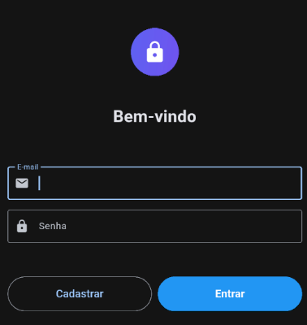
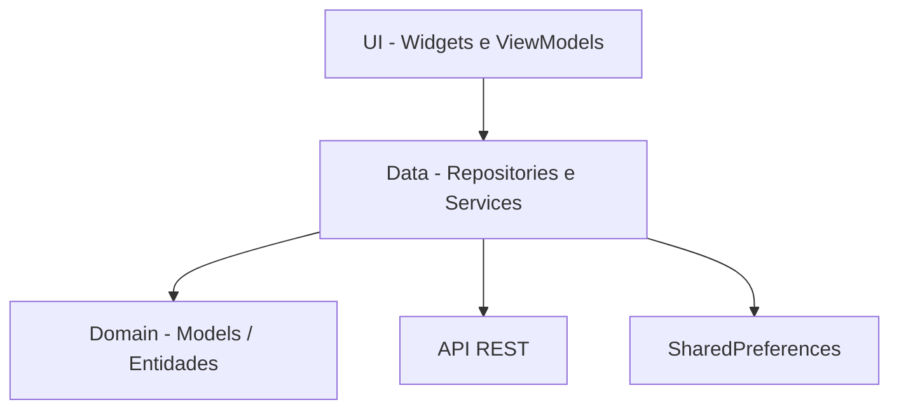
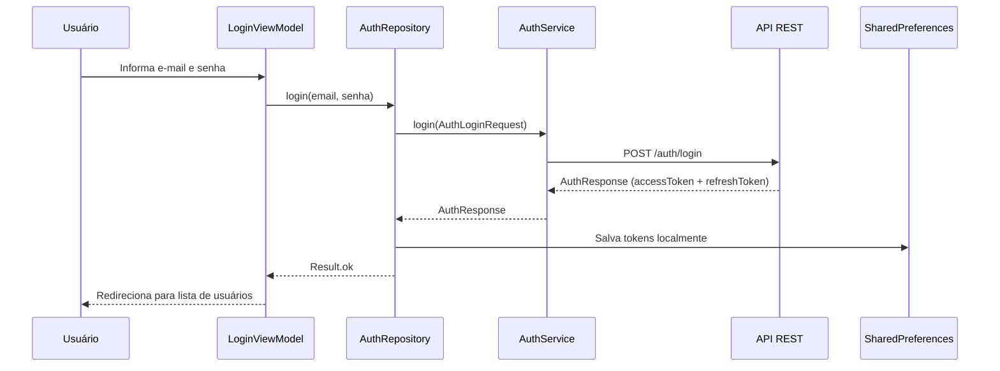
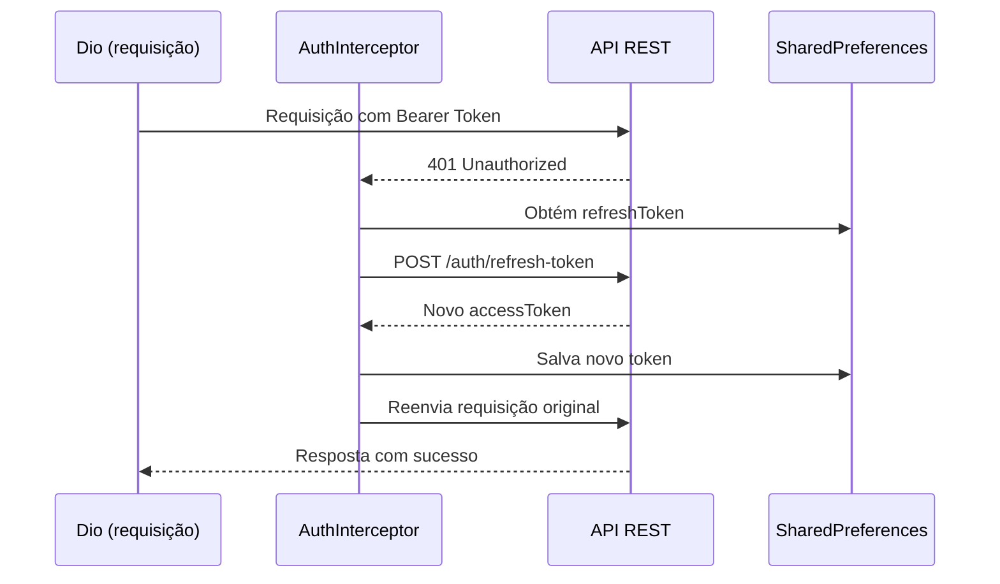
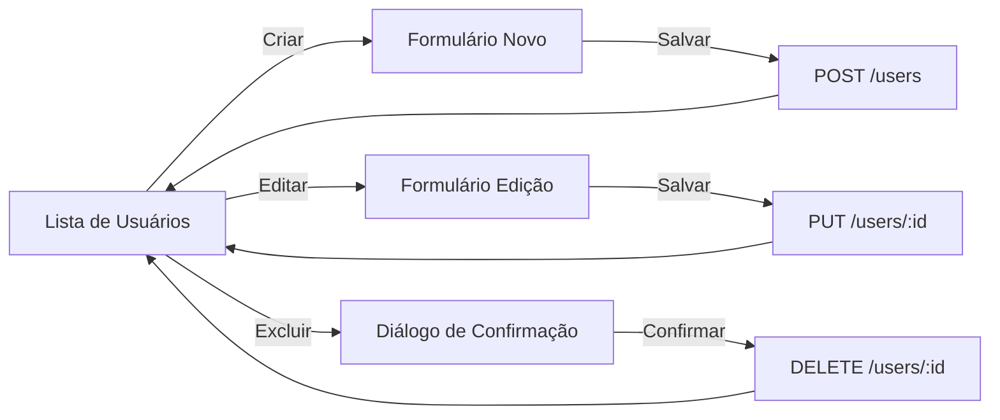
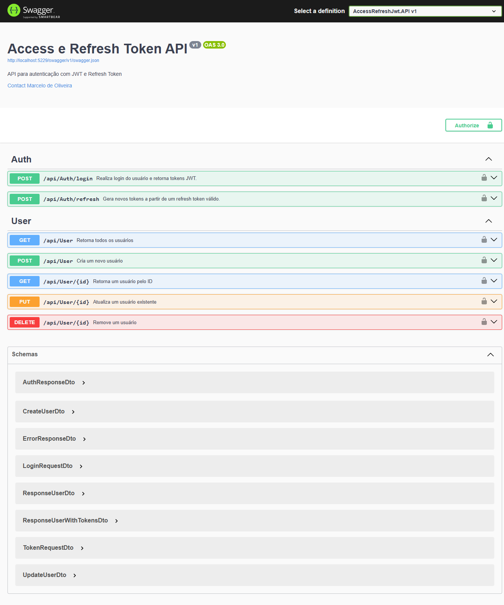

# Cadastro de Usuários — Flutter MVVM - JWT

Aplicativo mobile em Flutter para **autenticação** e **gerenciamento de usuários** (CRUD completo), construído com arquitetura **MVVM**, Provider para gerenciamento de estado e padrões como Result Type e Command Pattern.

## Screenshots

<p align="center">
  
</p>
<p align="center"><em>Tela de Login</em></p>

## Funcionalidades

- Login e logout com e-mail e senha
- Cadastro de novos usuários na tela de login
- Listagem de usuários com pull-to-refresh
- Criação, edição e exclusão de usuários
- Refresh automático de token (JWT) via interceptor
- Tema escuro com Material Design 3

## Arquitetura

O projeto segue o padrão **MVVM (Model-View-ViewModel)** com separação em camadas: Domain, Data e UI.



### Fluxo de Autenticação



### Refresh Automático de Token



### Fluxo CRUD de Usuários



## Estrutura de Pastas

```
lib/
├── config/                        # Configurações gerais
│   ├── dependencies.dart          # Injeção de dependências (Provider)
│   └── environment.dart           # URL base da API
│
├── core/                          # Infraestrutura e utilitários do core
│   ├── errors/
│   │   └── dio_error_handler.dart # Tratamento de erros HTTP do Dio
│   ├── exceptions/
│   │   ├── app_exception.dart     # Exceção base da aplicação
│   │   ├── http_exception.dart    # Exceções HTTP tipadas
│   │   ├── network_exception.dart # Exceções de rede
│   │   └── unknown_exception.dart # Exceções desconhecidas
│   └── network/
│       ├── auth_interceptor.dart  # Interceptor de token e refresh automático
│       └── dio_factory.dart       # Fábrica de instâncias do Dio
│
├── data/                          # Camada de dados
│   ├── repositories/
│   │   ├── auth/
│   │   │   ├── auth_repository.dart             # Interface do repositório de auth
│   │   │   └── auth_repository_impl_remote.dart # Implementação remota
│   │   └── user/
│   │       ├── user_repository.dart             # Interface do repositório de usuário
│   │       └── user_repository_impl_remote.dart # Implementação remota
│   └── services/
│       ├── auth/
│       │   └── auth_service.dart                # Chamadas HTTP de autenticação
│       ├── local/
│       │   └── shared_preferences_service.dart  # Armazenamento local de tokens
│       └── user/
│           └── user_service.dart                # Chamadas HTTP de usuário
│
├── domain/                        # Camada de domínio (modelos/entidades)
│   └── models/
│       ├── auth/
│       │   ├── auth_login_request.dart  # Modelo de requisição de login
│       │   ├── auth_refresh_token.dart  # Modelo de refresh token
│       │   └── auth_response.dart       # Modelo de resposta de autenticação
│       └── user/
│           └── user.dart                # Modelo de usuário
│
├── routing/                       # Navegação
│   ├── app_router.dart            # Configuração do GoRouter com guard de auth
│   └── routes.dart                # Definição das rotas
│
├── ui/                            # Camada de apresentação
│   ├── auth/
│   │   ├── login/
│   │   │   ├── view_model/
│   │   │   │   └── login_viewmodel.dart         # ViewModel de login
│   │   │   └── widgets/
│   │   │       └── auth_login.dart              # Tela de login
│   │   └── logout/
│   │       ├── view_model/
│   │       │   └── logout_viewmodel.dart        # ViewModel de logout
│   │       └── widget/
│   │           └── auth_logout_button_widget.dart # Botão de logout
│   ├── user/
│   │   ├── view_model/
│   │   │   └── user_viewmodel.dart              # ViewModel de usuário (CRUD)
│   │   └── widgets/
│   │       ├── user_form_page.dart              # Formulário de criação/edição
│   │       └── user_list_view.dart              # Lista de usuários
│   └── widgets/
│       └── common/
│           └── show_dialog_error_widget.dart     # Diálogo de erro reutilizável
│
├── utils/                         # Utilitários
│   ├── command.dart               # Command Pattern (Command0 e Command1)
│   └── result.dart                # Result Type (Ok | Failure)
│
└── main.dart                      # Ponto de entrada da aplicação
```

## Testes

O projeto possui uma suíte completa de testes automatizados cobrindo todas as camadas da arquitetura, com **204 testes** e **98.4% de cobertura de código**.

### Executar os Testes

```bash
# Executar todos os testes
flutter test

# Executar com relatório de cobertura
flutter test --coverage

# Executar um arquivo de teste específico
flutter test test/ui/user/view_model/user_viewmodel_test.dart
```

### Cobertura por Arquivo

| Arquivo | Cobertura |
|---------|-----------|
| `core/errors/dio_error_handler.dart` | 97.9% |
| `core/exceptions/app_exception.dart` | 100% |
| `core/exceptions/http_exception.dart` | 100% |
| `core/exceptions/network_exception.dart` | 100% |
| `core/exceptions/unknown_exception.dart` | 100% |
| `core/network/auth_interceptor.dart` | 100% |
| `data/repositories/auth/auth_repository_impl_remote.dart` | 88.9% |
| `data/repositories/user/user_repository_impl_remote.dart` | 100% |
| `data/services/auth/auth_service.dart` | 100% |
| `data/services/local/shared_preferences_service.dart` | 100% |
| `data/services/user/user_service.dart` | 100% |
| `domain/models/auth/auth_login_request.dart` | 100% |
| `domain/models/auth/auth_refresh_token.dart` | 100% |
| `domain/models/auth/auth_response.dart` | 100% |
| `domain/models/user/user.dart` | 100% |
| `routing/app_router.dart` | 95.2% |
| `ui/auth/login/view_model/login_viewmodel.dart` | 100% |
| `ui/auth/login/widgets/auth_login.dart` | 97.5% |
| `ui/auth/logout/view_model/logout_viewmodel.dart` | 100% |
| `ui/user/view_model/user_viewmodel.dart` | 100% |
| `ui/user/widgets/user_form_page.dart` | 100% |
| `ui/user/widgets/user_list_view.dart` | 95.7% |
| `ui/widgets/common/show_dialog_error_widget.dart` | 100% |
| `utils/command.dart` | 100% |
| `utils/result.dart` | 100% |
| **TOTAL** | **98.4%** |

### Estrutura de Testes

```
test/
├── mocks/                                          # Mocks manuais das dependências
│   ├── mock_auth_repository.dart
│   ├── mock_auth_service.dart
│   ├── mock_shared_preferences_service.dart
│   ├── mock_user_repository.dart
│   └── mock_user_service.dart
│
├── core/
│   ├── errors/
│   │   └── dio_error_handler_test.dart             # 19 testes — conversão de DioException
│   ├── exceptions/
│   │   └── exceptions_test.dart                    # 13 testes — hierarquia de exceções
│   └── network/
│       └── auth_interceptor_test.dart              # 8 testes — injeção de token e refresh
│
├── data/
│   ├── repositories/
│   │   ├── auth/
│   │   │   └── auth_repository_impl_remote_test.dart  # 7 testes — login/logout com tokens
│   │   └── user/
│   │       └── user_repository_impl_remote_test.dart  # 9 testes — CRUD com Result type
│   └── services/
│       ├── auth/
│       │   └── auth_service_test.dart              # 5 testes — chamadas HTTP de auth
│       ├── local/
│       │   └── shared_preferences_service_test.dart # 4 testes — armazenamento local
│       └── user/
│           └── user_service_test.dart              # 10 testes — chamadas HTTP de usuário
│
├── domain/
│   └── models/
│       ├── auth/
│       │   ├── auth_login_request_test.dart        # 4 testes — serialização
│       │   ├── auth_refresh_token_test.dart        # 4 testes — serialização
│       │   └── auth_response_test.dart             # 4 testes — serialização
│       └── user/
│           └── user_test.dart                      # 7 testes — serialização e id nullable
│
├── routing/
│   └── app_router_test.dart                        # 8 testes — rotas, redirects e guards
│
├── ui/
│   ├── auth/
│   │   ├── login/
│   │   │   ├── view_model/
│   │   │   │   └── login_viewmodel_test.dart       # 5 testes — command de login
│   │   │   └── widgets/
│   │   │       └── auth_login_test.dart            # 7 testes — formulário e validação
│   │   └── logout/
│   │       └── view_model/
│   │           └── logout_viewmodel_test.dart      # 5 testes — command de logout
│   ├── user/
│   │   ├── view_model/
│   │   │   └── user_viewmodel_test.dart            # 18 testes — CRUD e gerenciamento de lista
│   │   └── widgets/
│   │       ├── user_form_page_test.dart            # 14 testes — criação, edição e validação
│   │       └── user_list_view_test.dart            # 16 testes — listagem, exclusão e navegação
│   └── widgets/
│       └── common/
│           └── show_dialog_error_widget_test.dart  # 2 testes — exibição e dismiss do dialog
│
└── utils/
    ├── command_test.dart                           # 11 testes — estado, execução e prevenção duplicada
    └── result_test.dart                            # 7 testes — Ok, Failure e pattern matching
```

### Tipos de Testes

#### Testes Unitários

Cobrem as camadas de domínio, dados e lógica de negócio isoladamente:

- **Models** — Serialização (`toJson`/`fromJson`) e simetria de todos os modelos
- **Utils** — `Result` (pattern matching, Ok/Failure) e `Command` (estados, prevenção de execução duplicada, listeners)
- **Error Handling** — Conversão de `DioException` para exceções tipadas (`BadRequestException`, `UnauthorizedException`, etc.) e extração de mensagens de erro da API
- **Services** — Chamadas HTTP com Dio mockado via `http_mock_adapter`, cobrindo sucesso e cenários de erro para cada endpoint
- **Repositories** — Encapsulamento de services com `Result<T>`, incluindo salvamento de tokens, notificação de listeners e tratamento de falhas
- **ViewModels** — Lógica de negócio (login, logout, CRUD de usuários), gerenciamento de estado da lista e integração com Commands

#### Testes do AuthInterceptor

Testam o fluxo completo de autenticação no nível de rede:

- Injeção automática do Bearer Token em requests
- Interceptação de erro 401 e tentativa de refresh
- Salvamento de novos tokens após refresh bem-sucedido
- Reenvio da request original com o novo token
- Preservação de method, data e queryParameters no retry
- Limpeza do storage quando o refresh falha ou o token expira

#### Testes de Widget

Testam a interface do usuário com interações reais:

- **Tela de Login** — Renderização dos campos, validação de e-mail e senha, execução do login, exibição de erros e navegação para cadastro
- **Lista de Usuários** — Loading, lista vazia, listagem com dados, avatares, botões de editar/deletar, diálogo de confirmação de exclusão, retry em erro, navegação e pull-to-refresh
- **Formulário de Usuário** — Modo criação vs. edição, preenchimento automático dos campos, validação de todos os campos, submit com sucesso e exibição de erros
- **Diálogo de Erro** — Exibição da mensagem e dismiss ao clicar "Ok"

#### Testes de Routing

Testam o sistema de navegação e guards de autenticação:

- Redirecionamento para `/login` quando não autenticado
- Redirecionamento para `/users` quando já autenticado
- Acesso ao `/user-form` sem autenticação (para cadastro na tela de login)
- Reação automática a mudanças de estado de autenticação via `refreshListenable`

### Estratégia de Mocking

Os testes utilizam **mocks manuais** (sem code generation) que implementam as interfaces abstratas do projeto:

| Mock | Implementa | Permite configurar |
|------|-----------|-------------------|
| `MockAuthService` | `AuthService` | Resultado/erro de login e refresh |
| `MockUserService` | `UserService` | Resultado/erro de cada operação CRUD |
| `MockSharedPreferencesService` | `SharedPreferencesService` | Tokens e contadores de chamadas |
| `MockAuthRepository` | `AuthRepository` | Estado de login e resultados |
| `MockUserRepository` | `UserRepository` | Resultado de cada operação CRUD |

Para os testes de services HTTP, utiliza-se o pacote `http_mock_adapter` para mockar o Dio com respostas configuráveis por endpoint.

### Bibliotecas de Teste

| Pacote | Finalidade |
|--------|-----------|
| `flutter_test` | Framework de testes do Flutter (unit + widget) |
| `mockito` | Geração de mocks (disponível, não utilizado — mocks manuais preferidos) |
| `http_mock_adapter` | Mock do Dio para testes de services HTTP |

## Padrões Utilizados

### Result Type

Classe selada que substitui try-catch para tratamento de erros nos repositórios:

```dart
sealed class Result<T> {}
class Ok<T> extends Result<T> { final T value; }
class Failure<T> extends Result<T> { final Exception exception; }
```

### Command Pattern

Encapsula operações assíncronas nos ViewModels, rastreando os estados `running`, `error` e `completed`, e evitando execuções duplicadas:

- `Command0<T>` — sem argumentos
- `Command1<T, A>` — um argumento

Utilizado nos widgets com `ListenableBuilder` para reagir às mudanças de estado.

### Injeção de Dependências

Árvore manual de Provider configurada em `dependencies.dart`:

```
Services → Repositories → ViewModels
```

Todos injetados via `context.read<T>()`.

## Tech Stack

| Tecnologia | Versão | Finalidade |
|---|---|---|
| Flutter | 3.41.4 | Framework mobile |
| Provider | 6.1.5 | Gerenciamento de estado |
| GoRouter | 17.1.0 | Navegação declarativa com guards |
| Dio | 5.9.2 | Cliente HTTP com interceptors |
| SharedPreferences | 2.5.4 | Armazenamento local |

## Pré-requisitos

- [Flutter](https://flutter.dev/) instalado (versão 3.41.4 ou superior)
- [Docker Desktop](https://www.docker.com/products/docker-desktop/) instalado e em execução

## Como Executar

### 1. Subir a API e o Banco de Dados

O projeto inclui um `docker-compose.yml` que provisiona um banco de dados **SQL Server 2019** e a **API REST** necessária para o app.

```bash
# Criar e iniciar os containers em segundo plano
docker compose up -d
```

Isso irá criar dois containers:

| Container | Descrição | Porta |
|---|---|---|
| `sqlserver_2019` | Banco de dados SQL Server 2019 | `1433` |
| `access_refresh_jwt_api` | API REST com autenticação JWT | `5229` |

Após os containers estarem rodando, a documentação da API estará disponível via Swagger:

**Swagger UI:** [http://localhost:5229/swagger/index.html](http://localhost:5229/swagger/index.html)

<p align="center">
  
</p>
<p align="center"><em>Swagger UI — Documentação da API com os endpoints de Auth e User</em></p>

#### Comandos úteis do Docker

```bash
# Verificar se os containers estão rodando
docker compose ps

# Visualizar logs dos containers
docker compose logs -f

# Parar os containers
docker compose down

# Parar e remover os volumes (apaga os dados do banco)
docker compose down -v
```

### 2. Configurar o Endereço da API

> **IMPORTANTE:** Antes de executar o app, você **deve** alterar a string `baseUrlRemoteApi` no arquivo `lib/config/environment.dart` para o endereço IP da sua máquina na rede local.
>
> ```dart
> class Environment {
>   static const String baseUrlRemoteApi = "http://<SEU_IP_LOCAL>:5229/api/";
> }
> ```
>
> **Por que?** O emulador/dispositivo físico não consegue acessar `localhost` da mesma forma que o computador host. Você precisa usar o IP da máquina na rede (ex: `192.168.x.x`).
>
> Para descobrir seu IP local:
> - **Windows:** `ipconfig` no terminal
> - **Linux/macOS:** `ifconfig` ou `ip addr`

### 3. Executar o App Flutter

```bash
# Instalar dependências
flutter pub get

# Executar o app
flutter run

# Análise estática
flutter analyze

# Executar testes
flutter test

# Executar testes com cobertura
flutter test --coverage
```

## Rotas

| Rota | Tela | Descrição |
|---|---|---|
| `/login` | Login | Tela de autenticação |
| `/users` | Lista de Usuários | Tela principal (requer autenticação) |
| `/user-form` | Formulário de Usuário | Criação e edição de usuários |
