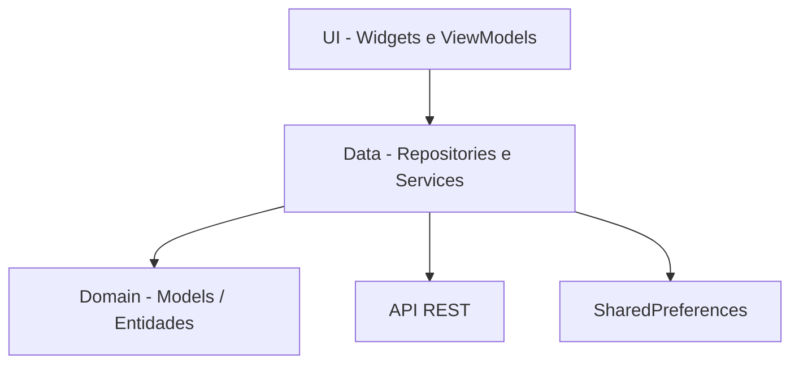
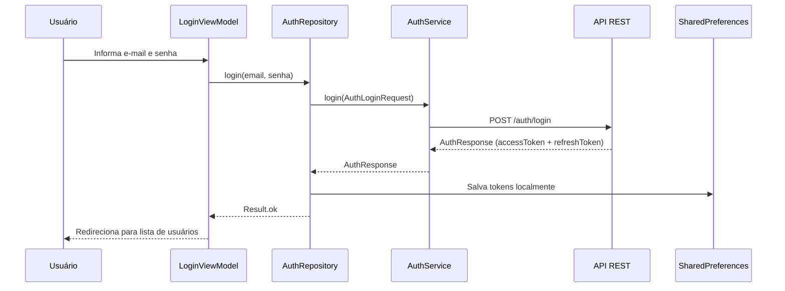
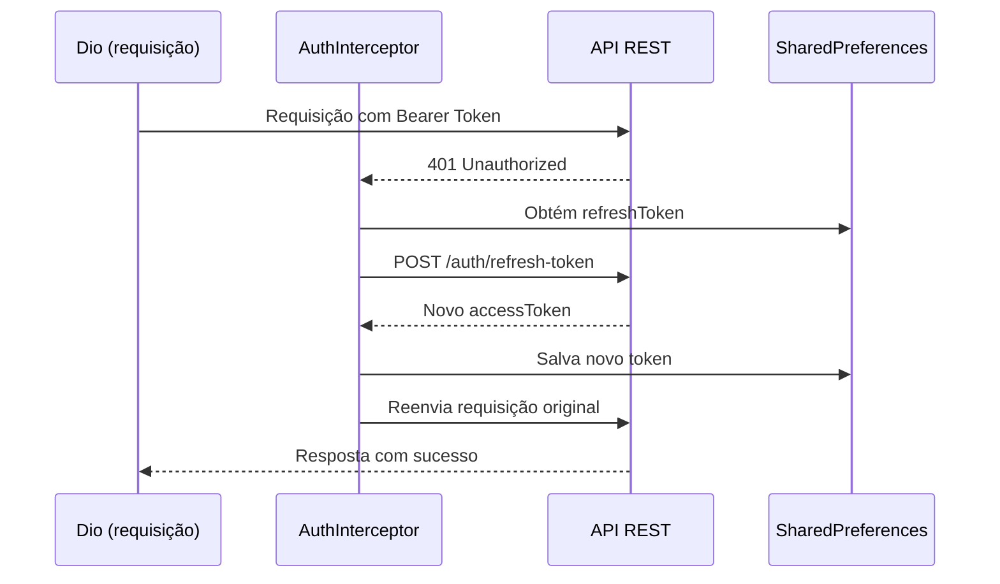
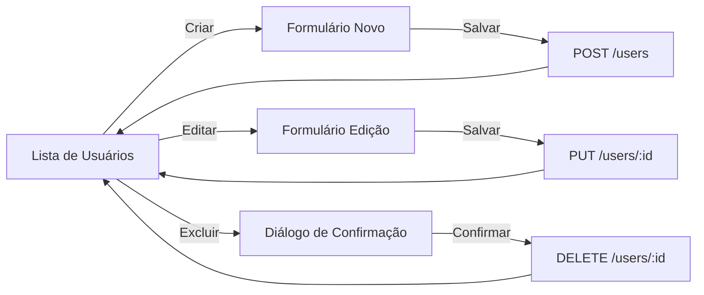

# Cadastro de Usuários — Flutter MVVM

Aplicativo mobile em Flutter para **autenticação** e **gerenciamento de usuários** (CRUD completo), construído com arquitetura **MVVM**, Provider para gerenciamento de estado e padrões como Result Type e Command Pattern.

## Funcionalidades

- Login e logout com e-mail e senha
- Cadastro de novos usuários na tela de login
- Listagem de usuários com pull-to-refresh
- Criação, edição e exclusão de usuários
- Refresh automático de token (JWT) via interceptor
- Tema escuro com Material Design 3

## Arquitetura

O projeto segue o padrão **MVVM (Model-View-ViewModel)** com separação em camadas: Domain, Data e UI.



### Fluxo de Autenticação



### Refresh Automático de Token



### Fluxo CRUD de Usuários



## Estrutura de Pastas

```
lib/
├── config/                        # Configurações gerais
│   ├── dependencies.dart          # Injeção de dependências (Provider)
│   └── environment.dart           # URL base da API
│
├── core/                          # Infraestrutura e utilitários do core
│   ├── errors/
│   │   └── dio_error_handler.dart # Tratamento de erros HTTP do Dio
│   ├── exceptions/
│   │   ├── app_exception.dart     # Exceção base da aplicação
│   │   ├── http_exception.dart    # Exceções HTTP tipadas
│   │   ├── network_exception.dart # Exceções de rede
│   │   └── unknown_exception.dart # Exceções desconhecidas
│   └── network/
│       ├── auth_interceptor.dart  # Interceptor de token e refresh automático
│       └── dio_factory.dart       # Fábrica de instâncias do Dio
│
├── data/                          # Camada de dados
│   ├── repositories/
│   │   ├── auth/
│   │   │   ├── auth_repository.dart             # Interface do repositório de auth
│   │   │   └── auth_repository_impl_remote.dart # Implementação remota
│   │   └── user/
│   │       ├── user_repository.dart             # Interface do repositório de usuário
│   │       └── user_repository_impl_remote.dart # Implementação remota
│   └── services/
│       ├── auth/
│       │   └── auth_service.dart                # Chamadas HTTP de autenticação
│       ├── local/
│       │   └── shared_preferences_service.dart  # Armazenamento local de tokens
│       └── user/
│           └── user_service.dart                # Chamadas HTTP de usuário
│
├── domain/                        # Camada de domínio (modelos/entidades)
│   └── models/
│       ├── auth/
│       │   ├── auth_login_request.dart  # Modelo de requisição de login
│       │   ├── auth_refresh_token.dart  # Modelo de refresh token
│       │   └── auth_response.dart       # Modelo de resposta de autenticação
│       └── user/
│           └── user.dart                # Modelo de usuário
│
├── routing/                       # Navegação
│   ├── app_router.dart            # Configuração do GoRouter com guard de auth
│   └── routes.dart                # Definição das rotas
│
├── ui/                            # Camada de apresentação
│   ├── auth/
│   │   ├── login/
│   │   │   ├── view_model/
│   │   │   │   └── login_viewmodel.dart         # ViewModel de login
│   │   │   └── widgets/
│   │   │       └── auth_login.dart              # Tela de login
│   │   └── logout/
│   │       ├── view_model/
│   │       │   └── logout_viewmodel.dart        # ViewModel de logout
│   │       └── widget/
│   │           └── auth_logout_button_widget.dart # Botão de logout
│   ├── user/
│   │   ├── view_model/
│   │   │   └── user_viewmodel.dart              # ViewModel de usuário (CRUD)
│   │   └── widgets/
│   │       ├── user_form_page.dart              # Formulário de criação/edição
│   │       └── user_list_view.dart              # Lista de usuários
│   └── widgets/
│       └── common/
│           └── show_dialog_error_widget.dart     # Diálogo de erro reutilizável
│
├── utils/                         # Utilitários
│   ├── command.dart               # Command Pattern (Command0 e Command1)
│   └── result.dart                # Result Type (Ok | Failure)
│
└── main.dart                      # Ponto de entrada da aplicação
```

## Padrões Utilizados

### Result Type

Classe selada que substitui try-catch para tratamento de erros nos repositórios:

```dart
sealed class Result<T> {}
class Ok<T> extends Result<T> { final T value; }
class Failure<T> extends Result<T> { final Exception exception; }
```

### Command Pattern

Encapsula operações assíncronas nos ViewModels, rastreando os estados `running`, `error` e `completed`, e evitando execuções duplicadas:

- `Command0<T>` — sem argumentos
- `Command1<T, A>` — um argumento

Utilizado nos widgets com `ListenableBuilder` para reagir às mudanças de estado.

### Injeção de Dependências

Árvore manual de Provider configurada em `dependencies.dart`:

```
Services → Repositories → ViewModels
```

Todos injetados via `context.read<T>()`.

## Tech Stack

| Tecnologia | Versão | Finalidade |
|---|---|---|
| Flutter | 3.41.4 | Framework mobile |
| Provider | 6.1.5 | Gerenciamento de estado |
| GoRouter | 17.1.0 | Navegação declarativa com guards |
| Dio | 5.9.2 | Cliente HTTP com interceptors |
| SharedPreferences | 2.5.4 | Armazenamento local |

## Pré-requisitos

- [Flutter](https://flutter.dev/) instalado (versão 3.41.4 ou superior)
- [Docker Desktop](https://www.docker.com/products/docker-desktop/) instalado e em execução

## Como Executar

### 1. Subir a API e o Banco de Dados

O projeto inclui um `docker-compose.yml` que provisiona um banco de dados **SQL Server 2019** e a **API REST** necessária para o app.

```bash
# Criar e iniciar os containers em segundo plano
docker compose up -d
```

Isso irá criar dois containers:

| Container | Descrição | Porta |
|---|---|---|
| `sqlserver_2019` | Banco de dados SQL Server 2019 | `1433` |
| `access_refresh_jwt_api` | API REST com autenticação JWT | `5229` |

Após os containers estarem rodando, a documentação da API estará disponível via Swagger:

**Swagger UI:** [http://localhost:5229/swagger/index.html](http://localhost:5229/swagger/index.html)

#### Comandos úteis do Docker

```bash
# Verificar se os containers estão rodando
docker compose ps

# Visualizar logs dos containers
docker compose logs -f

# Parar os containers
docker compose down

# Parar e remover os volumes (apaga os dados do banco)
docker compose down -v
```

### 2. Executar o App Flutter

```bash
# Instalar dependências
flutter pub get

# Executar o app
flutter run

# Análise estática
flutter analyze

# Executar testes
flutter test
```

## Rotas

| Rota | Tela | Descrição |
|---|---|---|
| `/login` | Login | Tela de autenticação |
| `/users` | Lista de Usuários | Tela principal (requer autenticação) |
| `/user-form` | Formulário de Usuário | Criação e edição de usuários |
